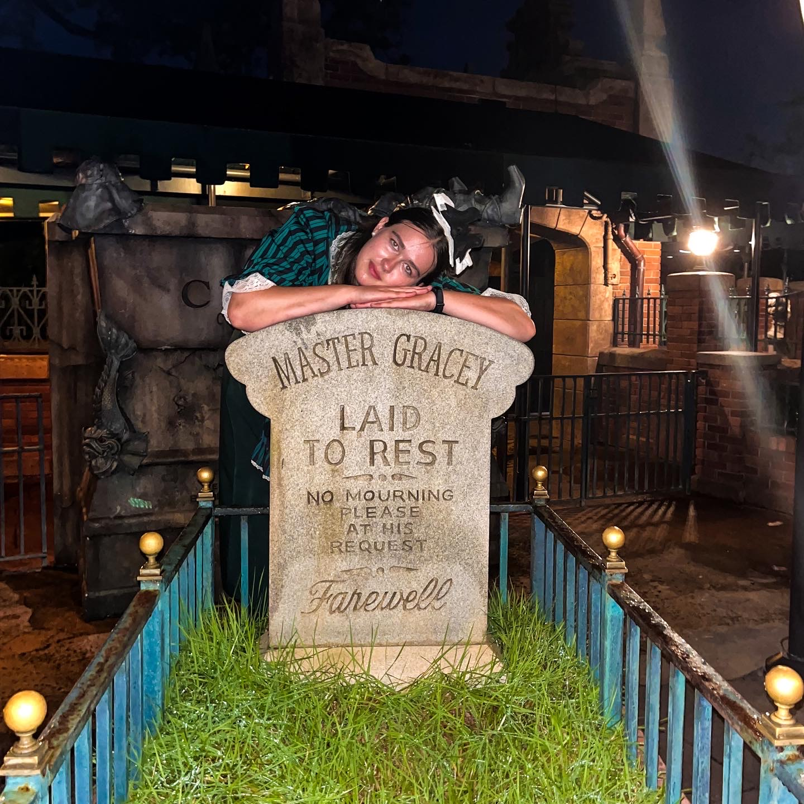

# InClass

 
# My Computer Science Experience
Unfortunately, my computer experience up to this point has been pretty slim. I'll bet slimmer than the rest of the students in the class. Really, my only programming experience has been through the computer science course I've taken here at New Paltz (CS1,2,+3). I'm not even a CS major, just a CS minor. I understand that this means that I am going to have a harder time this semester (I'm also taking Data Science.) , but I won't let this discourage me from working hard. I see my lack of experience as a challenge. 
# What I Want to Get Out of This Course
I plan on working as much as I need to to succeed in my CS courses this semester. I hope to learn and develop skills that I can apply to future projects. I'm not sure how I can use what I will learn in this course in my future, but I'm excited to learn nonetheless. 